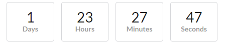

# Countdown Timer Challenge
Create a simple countdown timer that looks like this:  

The countdown should update every second.

You may use any JS framework, or no framework at all
Please write CSS without a framework
Provide a Github or JSFiddle link
